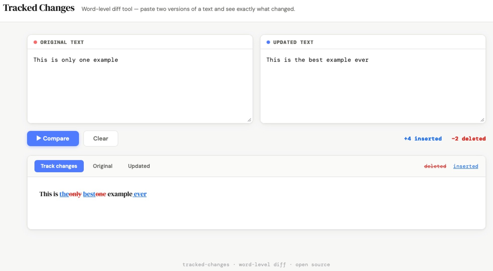

# 🔍 Tracked Changes — Text Diff Tool

A clean, browser-based word-level diff tool inspired by Microsoft Word's **Track Changes** feature. Paste two versions of a text and instantly see every insertion and deletion highlighted inline — no installs, no server, no dependencies.

🌐 **[Open the tool →](https://agudeloromero.github.io/text-diff-tool/)**



---

## What it does

Paste an **original** and an **updated** version of any text. The tool compares them at the word level and renders the differences inline:

- ~~deleted words~~ — shown in red with strikethrough
- _inserted words_ — shown in blue with underline

It matches sentences intelligently before doing word-level diffing, so even paragraphs that were restructured or reordered are handled gracefully rather than shown as fully deleted/inserted blocks.

---

## Features

- **Sentence-level matching** before word diffing — avoids false "whole paragraph deleted" results
- **Similarity pairing** for rewritten sentences — matches the closest equivalents across versions
- **Three views** — Track changes / Original / Updated
- **Insertion & deletion count** shown after comparing
- **Works entirely in the browser** — no data leaves your machine
- **No dependencies** — single HTML file, no npm, no build step

---

## How to use

1. Open the [live tool](https://agudeloromero.github.io/text-diff-tool/)
2. Paste your **original text** in the left box
3. Paste your **updated text** in the right box
4. Click **▶ Compare**
5. Toggle between **Track changes**, **Original**, and **Updated** views

---

## Use cases

- Reviewing text, manuscript or thesis revisions
- Comparing draft versions of scientific papers or reports
- Checking edits from collaborators
- Tracking changes in grant applications or cover letters
- Any plain-text comparison where Word isn't available

---

## Run locally

No build step needed. Just open the file in any browser:

```bash
git clone https://github.com/agudeloromero/text-diff-tool.git
cd text-diff-tool
open index.html   # macOS
# or double-click index.html in your file explorer
```

---

## How it works

The diff engine runs in three passes:

1. **Sentence splitting** — both texts are tokenised into sentences using punctuation and newline boundaries
2. **LCS matching** — sentences are matched across versions using Longest Common Subsequence on normalised text; unmatched sentences are further paired by word-overlap similarity (Jaccard-style)
3. **Word-level diff** — each matched sentence pair is diffed token by token using LCS, producing inline `<del>` / `<ins>` markup

Everything runs client-side in vanilla JavaScript — no frameworks, no external libraries.

---

## License

MIT — free to use, modify, and share.

---


